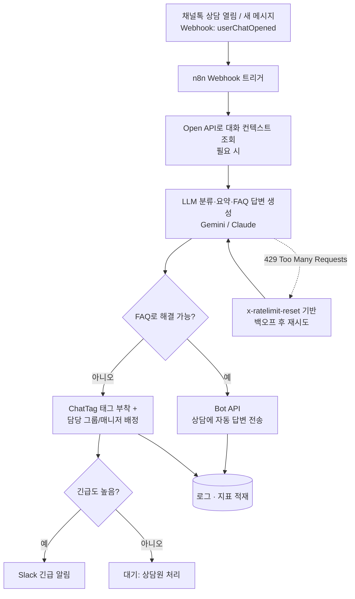

# 02. 채널톡 상담 문의 자동 분류·태깅·라우팅 (+ FAQ 1차 응답)

> **상태:** 설계 완료 · 구현 예정
> 채널톡 Open API + n8n + LLM으로, 들어오는 CS 문의를 **실시간으로 분류·태깅·담당 배정**하고 FAQ성 문의는 **봇이 1차 응답**하는 워크플로우.

---

## 🎯 문제 정의

CS를 운영해 보면 매일 똑같은 문의가 수백 건씩 쌓입니다. 상담원은 그 문의를 하나씩 읽고,

- 어떤 유형인지(배송/환불/결제/기술) 판단해 **태그를 붙이고**,
- 담당 팀·매니저에게 **수동으로 배정**하고,
- FAQ만 보면 끝날 질문에도 **일일이 답장**합니다.

정작 진짜 중요한 고객 대화에는 시간을 못 씁니다. 이 반복을 없애는 것이 목표입니다.

## 💡 해결 방식 · 설계 의도

문의가 들어오는 **순간** 자동으로 처리합니다.

- 새 상담이 열리면 Webhook으로 즉시 n8n에 전달 (폴링 X → **push**)
- LLM이 문의를 **유형·긴급도로 분류**하고 요약, FAQ 매칭 답변을 생성
- FAQ로 풀리면 **봇이 자동 응답**, 사람이 필요하면 **태그 + 담당 배정 + (긴급 시) Slack 알림**

> 완전 자동이 아니라 **"자동 처리 + 사람 확인"** 구조입니다. 애매하거나 중요한 문의는 반드시 상담원에게 넘깁니다.

---

## 🧭 아키텍처



---

## 🔧 워크플로우 상세 (n8n 노드)

| # | 노드 | 역할 |
|---|------|------|
| 1 | **Webhook (Trigger)** | 채널톡 `userChatOpened`·메시지 이벤트 수신. 폴링 대신 push라 rate limit 절약 |
| 2 | **HTTP Request — 컨텍스트 조회** | 이벤트 payload를 우선 사용, 필요 시 상담 단건 조회로 대화 맥락 보강 |
| 3 | **AI (Gemini/Claude)** | 문의를 `유형·긴급도·FAQ해결가능·요약`의 JSON으로 분류 + FAQ 답변 초안 생성 |
| 4 | **Switch — 분기** | FAQ 해결 가능 여부로 분기 |
| 5a | **HTTP Request — Bot 응답** | Bot API로 상담에 자동 답변 전송 |
| 5b | **HTTP Request — 태그·배정** | ChatTag로 태그 부착 + 담당 그룹/매니저 배정 |
| 6 | **Slack** | 긴급 건(긴급도 3) 담당자에게 알림 |
| 7 | **Error Trigger / Wait** | 429 응답 시 `x-ratelimit-reset`까지 대기 후 재시도, 실패 건은 재시도 큐 |

---

## 🔌 사용 API

**Base URL** `https://api.channel.io`
**인증(헤더)** `x-access-key` + `x-access-secret` — 채널톡 대시보드에서 발급

| 용도 | 메서드 · 엔드포인트(요약) |
|------|--------------------------|
| 상담 이벤트 수신 | **Webhook 등록** (scope: `userChatOpened` · 메시지 생성 등) |
| 상담·메시지 조회 | `GET /open/user-chats` (단건 조회 위주) |
| 자동 답변 전송 | **Bot API** (봇 생성/수정 · 봇 메시지 전송) |
| 상담 태그 부착 | **ChatTag** (상담 태그 생성 · 부착) |
| 담당 배정 | Group/Manager 배정 |

> 정확한 요청/응답 스키마는 [api-doc.channel.works](https://api-doc.channel.works/) 최신 버전을 기준으로 합니다.

**HTTP Request 노드 예시 (헤더 공통)**

```http
POST https://api.channel.io/open/...
x-access-key: {{$env.CHANNEL_ACCESS_KEY}}
x-access-secret: {{$env.CHANNEL_ACCESS_SECRET}}
Content-Type: application/json
```

---

## 🚦 Rate Limit 대응 (Leaky Bucket)

요청이 버킷에 쌓이고 정해진 속도로 비워집니다. 버킷이 가득 차면 `429 Too Many Requests`.

| 플랜 | 엔드포인트 | 버킷 용량 | 누수 속도 |
|------|------------|-----------|-----------|
| 비 Enterprise | `GET /open/user-chats` (목록) | 100 | 초당 10건 |
| 비 Enterprise | 그 외 모든 엔드포인트 | 1,000 | 초당 10건 |
| Enterprise | 모든 엔드포인트 | 1,000 | 초당 50건 |

**설계 전략**

- **Webhook(push) 우선** — 부하 큰 `user-chats` 목록 폴링(버킷 100)을 지양
- n8n 동시 실행·루프에 딜레이/배치를 적용해 초당 누수 속도 내로 유지
- 429 발생 시 응답 헤더 `x-ratelimit-reset`(epoch 초)까지 대기 후 재시도 (멱등 처리)

---

## 🧠 FAQ 지식 · 프롬프트 설계

FAQ·상품·정책을 `(질문 유형 → 표준 답변)` 형태로 구조화해 LLM 컨텍스트로 주입합니다(지식 변환).

**분류 프롬프트(예시)**

```
너는 CS 상담 분류기다. 아래 고객 문의를 다음 JSON으로만 응답하라.
{
  "type": "배송|환불|결제|기술|기타",
  "urgency": 1~3,               // 3이 가장 긴급
  "faq_answerable": true|false,  // FAQ로 즉시 해결 가능 여부
  "summary": "한 문장 요약",
  "reply_draft": "faq_answerable가 true일 때 고객에게 보낼 답변"
}
문의: "{{고객 메시지}}"
FAQ 지식: "{{FAQ 컨텍스트}}"
```

**응답(예시)**

```json
{
  "type": "배송",
  "urgency": 1,
  "faq_answerable": true,
  "summary": "주문 상품 배송 예상일 문의",
  "reply_draft": "주문하신 상품은 결제 완료 후 평균 2~3일 내 출고됩니다. 송장 등록 시 알림톡으로 안내드려요."
}
```

이 JSON을 기준으로 태그(`type`)·라우팅·자동응답 여부(`faq_answerable`)·긴급 알림(`urgency`)이 분기됩니다.

---

## 🛟 에러 핸들링

- 모든 HTTP 노드에 실패 분기 연결 → 실패 시 **Slack 알림**으로 즉시 인지
- 429는 별도로 감지해 **백오프 재시도**(위 Rate Limit 전략)
- LLM이 형식에 안 맞는 응답을 주면 재요청 또는 사람 라우팅으로 폴백

---

## 📈 기대 효과

- 반복 문의 **자동 분류·태깅·라우팅** → 상담원이 핵심 대화에 집중 (CS 효율화)
- FAQ성 문의 **봇 1차 응답**으로 대기 시간 단축
- 축적된 태그·요약 데이터로 **데이터 기반 CX 인사이트**(문의 Top 유형·급증 이슈) 확보

---

## ▶️ 실행 · Import

```bash
# 1. 환경변수 설정
export CHANNEL_ACCESS_KEY=...      # 채널톡 대시보드 발급
export CHANNEL_ACCESS_SECRET=...

# 2. n8n 실행
n8n start

# 3. 워크플로우 import
# n8n UI → Settings → Import from file → workflow.json 선택

# 4. 채널톡 Webhook 등록 (scope: userChatOpened)
#    Webhook URL = n8n Webhook 노드의 Production URL
```

---

## 🔭 확장 방향

- 채널톡 **MCP for AI Agents / Bot API**와 연계해 ALF형 상담봇으로 고도화
- 스케줄 트리거로 **주간 CX 리포트**(문의 Top 유형·급증 이슈) 자동 발송
- 주문·배송 등 **외부 시스템 API 연동**으로 실시간 업데이트되는 스마트 응답
