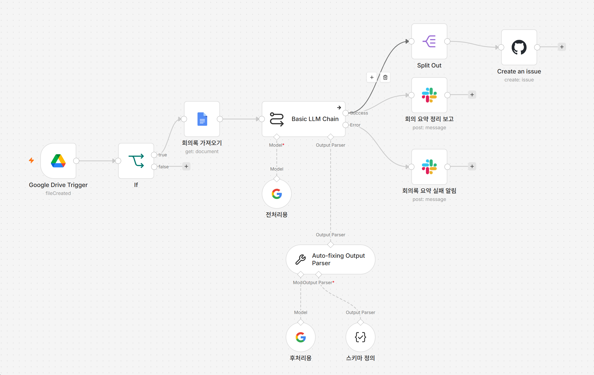

# 01. 회의록 → 액션아이템 자동 추출

> 회의에서 정한 일이 실행에서 누락되지 않도록, 회의록에서 액션아이템을 추출해 이슈 트래커에 자동 등록하는 n8n 파이프라인

---

## 🎯 해결한 문제

회의는 잘 끝나는데, 그 다음이 문제였다.

"이건 누가, 언제까지"까지 정해놓고도 회의가 끝나면 결정사항이 흩어진다. 누군가 회의록을 정리해 공유하고, 액션아이템을 이슈로 옮기는 작업을 매번 손으로 해야 했다. **결정된 것이 실행에서 누락되는 지점** — QA로서 가장 못 견디는 상황이다. 테스트 케이스가 빠지면 버그가 새듯, 회의에서 정한 액션아이템이 빠지면 일이 샌다.

| | Before | After |
|---|---|---|
| 회의록 정리 | 수동 (건당 15~20분) | 자동 (0분) |
| 액션아이템 등록 | 수동으로 이슈 생성 | 자동 등록 |
| 누락 위험 | 사람 의존 | 파이프라인이 보장 |

---

## 🏗 아키텍처



```
Google Drive Trigger  (회의록 파일 감지)
    → IF               (Google Docs 문서만 통과 · mimeType 필터)
    → Google Docs      (회의록 텍스트 읽기)
    → Basic LLM Chain  (요약 · 결정사항 · 액션아이템 추출)
        ├─ Gemini Chat Model
        └─ Auto-fixing Output Parser → Structured Output Parser
    │
    ├─→ Slack          (요약 · 결정사항 발송)
    ├─→ Split Out      (액션아이템 배열 펼치기)
    │      → GitHub Issues  (아이템마다 이슈 1개 생성)
    └─[에러]→ Slack    (처리 실패 알림)
```

---

## ⚙️ 동작 방식

1. **회의록 수집** — Google Meet에서 생성된 트랜스크립트가 Drive에 저장되면, Drive Trigger가 폴링으로 감지한다.
2. **입력 검증** — 폴더에는 회의록 외 파일도 섞일 수 있어, `mimeType`으로 Google Docs 문서만 통과시킨다.
3. **텍스트 추출** — Google Docs 노드로 회의록 본문을 읽는다. (문서 내 자동 요약 탭은 무시하고 원문 스크립트만 근거로 삼도록 프롬프트로 통제)
4. **구조화 추출** — LLM이 요약·결정사항·액션아이템을 JSON으로 반환한다. 액션아이템은 `{담당자, 할일, 기한, 우선순위}` 필드로 분리.
5. **실행 연결** — 요약은 Slack으로 1건 발송, 액션아이템 배열은 Split Out으로 펼쳐 각각을 GitHub 이슈로 등록.

---

## 🔍 기술적 포인트

이 프로젝트의 핵심은 "노드를 잇는 것"이 아니라 **신뢰할 수 없는 출력을 신뢰할 수 있게 만드는 설계**였다.

**LLM 출력의 비결정성 방어 (3중 방어선)**
LLM은 본질적으로 비결정적이라, 프롬프트로 "JSON만 답해"라고 해도 코드펜스를 붙이거나 필드를 누락한다. 가끔 실패하는 컴포넌트가 가장 위험하다는 QA 관점에서, 세 겹으로 방어했다.
- 프롬프트에 출력 형식을 명시 (특히 "값 없으면 필드 생략 말고 null")
- Structured Output Parser로 JSON 스키마 강제
- Auto-fixing Output Parser로 파싱 실패 시 자동 복구(재요청)

**경계 조건 설계**
회의록은 깔끔하지 않다. 테스트 케이스의 경계값을 잡던 방식으로 프롬프트 규칙을 정의했다.
- 담당자 미명시 → `null` (LLM이 추측으로 채우지 않도록)
- 상대적 날짜("다음 주 금요일") → 회의 날짜 기준 `YYYY-MM-DD` 변환
- 액션아이템 없음 → 빈 배열 (억지 생성 금지)
- 원문 vs 자동요약 → 신뢰할 수 있는 원본(스크립트)만 근거로

**Silent failure 방지**
자동화가 신뢰를 얻으려면 실패했을 때 실패했다고 말해줘야 한다. 외부 LLM API는 순간 과부하(503)로 죽을 수 있어, `Retry On Fail`로 자동 재시도하고, 최종 실패는 에러 브랜치로 Slack 알림을 보낸다. 회의록이 조용히 누락되는 일이 없도록.

---

## 🛠 기술 스택

| 카테고리 | 도구 |
|---|---|
| 자동화 엔진 | n8n (self-hosted, Docker) |
| AI | Google Gemini API |
| 데이터 소스 | Google Drive · Google Docs API |
| 출력 | GitHub Issues · Slack |

> AI 모델은 n8n의 Chat Model 서브노드로 분리돼 있어, 워크플로우 수정 없이 교체 가능하다. (실제로 개발 중 모델 폐기·전환을 여러 번 겪으며 이 구조의 이점을 확인)

---

## 📌 한계와 다음 단계

- 현재 Drive Trigger는 폴링 방식이라, 24시간 자동 실행하려면 상시 가동 서버가 필요하다. 로컬 개발 완료 후 클라우드 배포 예정.
- 이슈 트래커는 GitHub로 구현했으나, 팀 환경에 맞춰 Notion·Jira 등으로 교체 가능한 구조다.

---

## 📝 제작 과정

이 워크플로우를 만들며 겪은 과정(OAuth 관문, LLM 출력 신뢰성 확보, 모델 전환 삽질 등)을 블로그 시리즈로 기록했습니다.

- [n8n 자동화 시리즈 — Velog](https://velog.io/@00kang_jh/posts)

---

## ▶️ 실행 방법

`workflow.json`을 n8n에 import한 뒤, 아래 자격증명을 각자 환경에 맞게 연결하세요.

- Google Drive / Google Docs (OAuth2)
- Google Gemini (API Key)
- GitHub (Personal Access Token)
- Slack (OAuth2 또는 Bot Token)

자세한 설치·import 방법은 [../../docs/n8n-setup-guide.md](../../docs/n8n-setup-guide.md) 참고.
